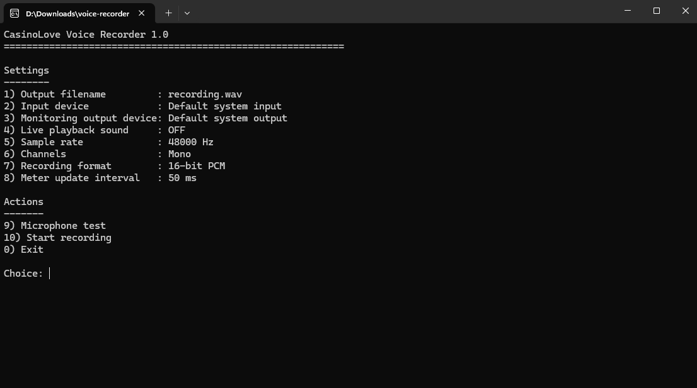
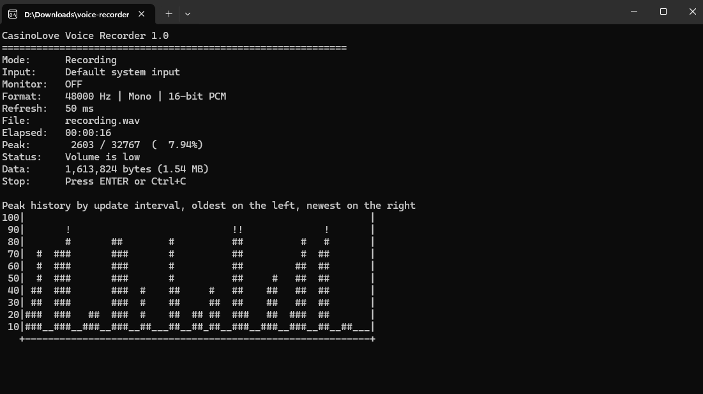

# CasinoLove Voice Recorder for Windows

A lightweight Windows x64 voice recorder written in C.

This repository contains the native Windows version of CasinoLove Voice Recorder. It is a small terminal-based recorder focused on practical microphone capture, microphone testing, live peak metering, and 16-bit PCM WAV recording.

## Screenshots





## Features

- Windows x64 native application written in C
- menu-driven workflow
- input device detection and selection
- playback output device selection for live playback sound
- microphone test mode without saving a file
- 16-bit PCM WAV recording
- common sample rates including 44.1 kHz, 48 kHz, and 192 kHz, depending on device support
- mono and stereo options
- live peak level display with percentage
- rolling history graph in the terminal
- overwrite confirmation when the output file already exists
- continuous writing during recording for safer file handling
- Very small Windows x64 executable (<100 KBytes)
- no external runtime dependencies


## Download and documentation

Windows executable download:
https://tech.casinolove.org/voice-recorder/voice-recorder.exe

Project documentation:
https://tech.casinolove.org/voice-recorder/


## Build requirements

This project is intended for Windows x64.

You can compile it with MinGW-w64 GCC or with Microsoft Visual C++.

The app uses the Windows multimedia library `winmm`.

## Build with GCC

```bash
gcc -O2 -Wall -Wextra -o voice-recorder.exe voice-recorder.c -lwinmm
```


## Usage

Run the executable from Windows Terminal, PowerShell, or Command Prompt.

The app opens into an internal menu system where you can:

- set the output filename
- choose the input device
- choose the playback output device
- enable or disable live playback sound
- choose the sample rate
- choose mono or stereo
- choose the meter and graph update interval
- run a microphone test
- start recording

During recording or microphone testing, the app shows:

- elapsed time
- peak level
- peak percentage
- current status
- rolling history graph
- file size while recording

## Recording format

This version records:

- WAV
- PCM
- 16-bit


